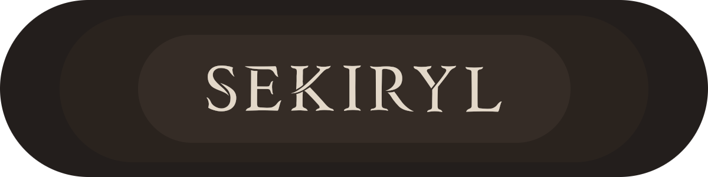

  

 

  
&nbsp;&nbsp;&nbsp;&nbsp;
  

 

  

 

  
   
  

 

<b>⚙️ About Me</b>

🌱 I’m currently learning **C++**  
🧑‍💻 I like building **what I can’t find**  
💻 I use **Arch** BTW (Hyprland 🪟)  
📚 I survive on **Physics**, **Coffee**, and **Shell Scripts**  
🎮 Favorite Game: `Sekiro: Shadows Die Twice` 🥷  
🧪 Fun Fact: I might be more CLI than human

  

 <i>“Keep your code clean and your rice cooker cleaner.”</i>   Made with ❤️ and <code>vim</code> by Sekiryl 

